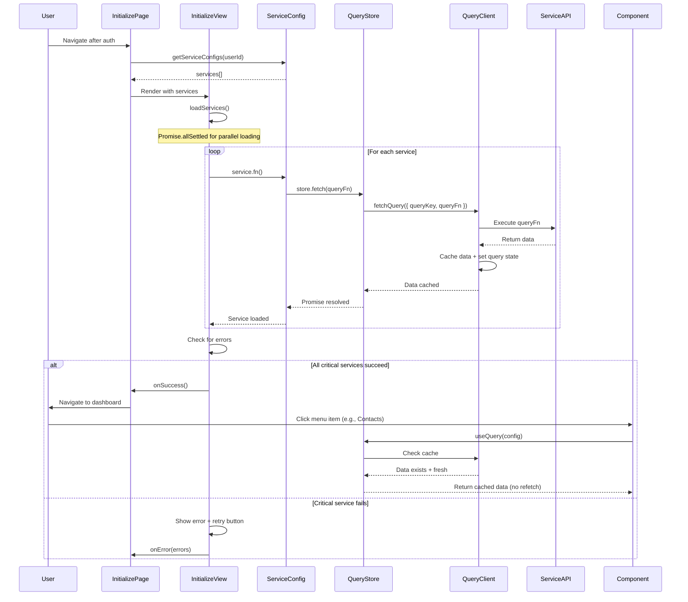

# Initialization Flow

This document describes how the application initialization works with TanStack Query integration.

## Flow Diagram



## Key Components

### 1. Service Configuration
```typescript
{
  name: 'contacts',
  fn: () => contactsStore.fetch(() => contactService.listContacts()),
  setter: () => {}, // No-op, fetch() handles setting data
  critical: false,
  message: 'Loading contacts...',
}
```

### 2. Query Store Fetch
```typescript
// Properly fetches and caches data through TanStack Query
contactsStore.fetch(() => contactService.listContacts())
```

### 3. Component Usage
```typescript
// Uses cached data from initialization, no refetch
const contactsQuery = contactsStore.useQuery(contactsQueryConfig);
```

## Why This Works

1. **Proper Query State**: `queryClient.fetchQuery()` sets data AND marks query as fetched with timestamp
2. **No Refetch**: When component calls `useQuery()`, React Query sees data is fresh (within `staleTime`)
3. **Parallel Loading**: All services load simultaneously via `Promise.allSettled()`
4. **Error Handling**: Failed services don't block non-critical data loading

## Configuration

Default query config prevents unnecessary refetches:
```typescript
{
  staleTime: 5 * 60 * 1000,      // 5 minutes
  gcTime: 30 * 60 * 1000,        // 30 minutes
  refetchOnMount: false,
  refetchOnWindowFocus: false,
}
```
