# AI Workflow Visualization

Visual representation of AI workflows in the Matrix service - showing workflows being built and jobs currently running.

## Overview

This document defines the visual structure for displaying:
- **Building Workflows**: Draft workflows with their step configurations
- **Running Workflows**: Active jobs with real-time execution status

## Data Sources

### Matrix API Endpoints

**Building Workflows:**
```
GET /api/v1/workflows?status=draft
GET /api/v1/workflows/{workflow_id}/steps
```

**Running Workflows:**
```
GET /api/v1/jobs?status=running
GET /api/v1/jobs/{job_id}/steps
```

### Data Models

**Workflow:**
- `id`: UUID
- `name`: string
- `description`: string
- `status`: "draft" | "published"
- `created_at`: datetime
- `updated_at`: datetime

**WorkflowStep:**
- `id`: UUID
- `workflow_id`: UUID
- `name`: string
- `step_index`: number
- `agent_id`: UUID
- `tool_ids`: UUID[]
- `prompt_ids`: UUID[]
- `timeout_seconds`: number

**Job:**
- `id`: UUID
- `workflow_id`: UUID
- `status`: "pending" | "running" | "completed" | "failed" | "cancelled"
- `started_at`: datetime
- `completed_at`: datetime

**JobStep:**
- `id`: UUID
- `job_id`: UUID
- `step_id`: UUID
- `step_index`: number
- `status`: "pending" | "running" | "completed" | "failed" | "cancelled"
- `attempt_number`: number
- `started_at`: datetime
- `completed_at`: datetime
- `error_message`: string

## Visual Design

### 🎨 Workflow Timeline View


### 🚀 Real-Time Execution Flow

```mermaid
%%{init: {'theme':'base', 'themeVariables': { 'fontSize':'16px'}}}%%
graph LR
    START((🎬<br/>START))
    
    subgraph INGEST[" "]
        I1["📥 Data Ingestion<br/>━━━━━━━━━━━━━━<br/>✓ COMPLETED<br/>⏱️ 12.3s<br/>🤖 Ingest Agent<br/>🔧 S3Reader + Validator"]
    end
    
    subgraph TRANSFORM[" "]
        T1["⚙️ Transform<br/>━━━━━━━━━━━━━━<br/>✓ COMPLETED<br/>⏱️ 8.7s<br/>🤖 Transform Agent<br/>🔧 Pandas + Cleaner"]
    end
    
    subgraph ANALYZE[" "]
        A1["🧠 Analysis<br/>━━━━━━━━━━━━━━<br/>⟳ RUNNING 67%<br/>⏱️ 45.2s<br/>🤖 Analytics Agent<br/>🔧 ML Model"]
    end
    
    subgraph STORE[" "]
        S1["💾 Storage<br/>━━━━━━━━━━━━━━<br/>○ PENDING<br/>⏳ Waiting...<br/>🤖 Storage Agent<br/>🔧 PostgreSQL"]
    end
    
    END((🏁<br/>END))
    
    START ==>|Input Data| INGEST
    INGEST ==>|Validated| TRANSFORM
    TRANSFORM ==>|Cleaned| ANALYZE
    ANALYZE ==>|Results| STORE
    STORE ==>|Saved| END
    
    style START fill:#1976d2,stroke:#0d47a1,stroke-width:4px,color:#fff
    style END fill:#616161,stroke:#424242,stroke-width:4px,color:#fff
    style I1 fill:#4caf50,stroke:#2e7d32,stroke-width:3px,color:#fff,rx:10,ry:10
    style T1 fill:#4caf50,stroke:#2e7d32,stroke-width:3px,color:#fff,rx:10,ry:10
    style A1 fill:#ff9800,stroke:#e65100,stroke-width:4px,color:#fff,rx:10,ry:10
    style S1 fill:#90a4ae,stroke:#546e7a,stroke-width:2px,rx:10,ry:10
    style INGEST fill:#e8f5e9,stroke:#4caf50,stroke-width:2px
    style TRANSFORM fill:#e8f5e9,stroke:#4caf50,stroke-width:2px
    style ANALYZE fill:#fff3e0,stroke:#ff9800,stroke-width:3px
    style STORE fill:#eceff1,stroke:#90a4ae,stroke-width:2px
```



### 🎯 Multi-Workflow Dashboard

```mermaid
%%{init: {'theme':'base', 'themeVariables': { 'fontSize':'14px'}}}%%
flowchart LR
    subgraph BUILD["🔨 BUILDING WORKFLOWS"]
        direction TB
        
        subgraph WF1["📊 Data Processing Pipeline"]
            direction LR
            B1["1️⃣<br/>Initialize"]:::draft
            B2["2️⃣<br/>Configure"]:::draft
            B3["3️⃣<br/>Validate"]:::draft
            B4["4️⃣<br/>Deploy"]:::draft
            B1 --> B2 --> B3 --> B4
        end
        
        subgraph WF2["🤖 ML Model Training"]
            direction LR
            M1["1️⃣<br/>Data Prep"]:::draft
            M2["2️⃣<br/>Features"]:::draft
            M3["3️⃣<br/>Train"]:::draft
            M4["4️⃣<br/>Evaluate"]:::draft
            M5["5️⃣<br/>Export"]:::draft
            M1 --> M2 --> M3 --> M4 --> M5
        end
    end
    
    subgraph RUN["▶️ RUNNING WORKFLOWS"]
        direction TB
        
        subgraph JOB1["📈 Real-time Analytics • 11:15:32"]
            direction LR
            R1["📥<br/>Ingest<br/>✓ 12s"]:::completed
            R2["⚙️<br/>Transform<br/>✓ 8s"]:::completed
            R3["🧠<br/>Analyze<br/>⟳ 45s"]:::running
            R4["💾<br/>Store<br/>○"]:::pending
            R1 --> R2 --> R3 --> R4
        end
        
        subgraph JOB2["✍️ Content Generation • 11:20:15"]
            direction LR
            C1["💭<br/>Prompt<br/>✓ 1s"]:::completed
            C2["✨<br/>Generate<br/>⟳ 23s"]:::running
            C3["👁️<br/>Review<br/>○"]:::pending
            C1 --> C2 --> C3
        end
    end
    
    classDef draft fill:#e3f2fd,stroke:#1976d2,stroke-width:2px,color:#0d47a1
    classDef completed fill:#4caf50,stroke:#2e7d32,stroke-width:2px,color:#fff
    classDef running fill:#ff9800,stroke:#e65100,stroke-width:4px,color:#fff
    classDef pending fill:#cfd8dc,stroke:#78909c,stroke-width:2px,color:#37474f
    
    style BUILD fill:#fafafa,stroke:#bdbdbd,stroke-width:2px
    style RUN fill:#fff8e1,stroke:#ffa726,stroke-width:3px
    style WF1 fill:#fff,stroke:#90caf9,stroke-width:2px
    style WF2 fill:#fff,stroke:#90caf9,stroke-width:2px
    style JOB1 fill:#fff,stroke:#ffb74d,stroke-width:2px
    style JOB2 fill:#fff,stroke:#ffb74d,stroke-width:2px
```



### 🎭 Workflow State Machine

```mermaid
%%{init: {'theme':'base', 'themeVariables': { 'fontSize':'16px'}}}%%
stateDiagram-v2
    [*] --> Draft: Create Workflow
    
    Draft --> Published: Publish
    Draft --> Draft: Edit Steps
    
    Published --> JobPending: Execute
    
    JobPending --> JobRunning: Start
    JobPending --> JobCancelled: Cancel
    
    JobRunning --> StepRunning: Process Steps
    
    StepRunning --> StepCompleted: Success
    StepRunning --> StepFailed: Error
    StepRunning --> JobCancelled: Cancel
    
    StepCompleted --> StepRunning: Next Step
    StepCompleted --> JobCompleted: All Done
    
    StepFailed --> StepRunning: Retry
    StepFailed --> JobFailed: Max Retries
    
    JobCompleted --> [*]
    JobFailed --> [*]
    JobCancelled --> [*]
    
    note right of Draft
        🔨 Building Phase
        Configure agents, tools, steps
    end note
    
    note right of JobRunning
        ▶️ Execution Phase
        Real-time monitoring
    end note
    
    note right of JobCompleted
        ✅ Success
        Results available
    end note
```



### 📊 Execution Progress Gantt

```mermaid
%%{init: {'theme':'base', 'themeVariables': { 'fontSize':'14px'}}}%%
gantt
    title Real-time Analytics Job Execution
    dateFormat HH:mm:ss
    axisFormat %H:%M:%S
    
    section Ingest
    Data Ingestion ✓     :done, ingest, 11:15:32, 12s
    
    section Transform
    Data Transform ✓     :done, transform, after ingest, 8s
    
    section Analyze
    Analysis ⟳          :active, analyze, after transform, 45s
    
    section Store
    Storage ○           :crit, store, after analyze, 10s
```



### 🎪 Interactive Status Board

```mermaid
%%{init: {'theme':'base'}}%%
mindmap
  root((🎯 AI Workflows))
    🔨 Building
      📊 Data Pipeline
        4 Steps
        Draft Mode
      🤖 ML Training
        5 Steps
        Draft Mode
    ▶️ Running
      📈 Analytics
        Step 3/4
        67% Complete
        ⟳ Active
      ✍️ Content Gen
        Step 2/3
        Attempt 2
        ⟳ Active
    ✅ Completed
      12 Jobs Today
      98% Success
    ❌ Failed
      2 Jobs
      Retry Available
```



## Component Structure

### TypeScript Types

```typescript
type WorkflowStatus = 'draft' | 'published';
type JobStatus = 'pending' | 'running' | 'completed' | 'failed' | 'cancelled';

interface WorkflowStep {
  id: string;
  workflow_id: string;
  name: string;
  step_index: number;
  agent_id: string;
  tool_ids: string[];
  prompt_ids: string[];
  timeout_seconds: number;
}

interface Workflow {
  id: string;
  name: string;
  description: string;
  status: WorkflowStatus;
  steps: WorkflowStep[];
}

interface JobStep {
  id: string;
  job_id: string;
  step_id: string;
  step_index: number;
  status: JobStatus;
  attempt_number: number;
  started_at?: string;
  completed_at?: string;
  error_message?: string;
}

interface Job {
  id: string;
  workflow_id: string;
  status: JobStatus;
  started_at?: string;
  completed_at?: string;
  steps: JobStep[];
}
```

### Color Palette

| Status | Background | Border | Text |
|--------|-----------|--------|------|
| Completed | `#4caf50` | `#388e3c` | `#fff` |
| Running | `#ff9800` | `#f57c00` | `#fff` |
| Pending | `#e0e0e0` | `#9e9e9e` | `#000` |
| Failed | `#f44336` | `#c62828` | `#fff` |
| Cancelled | `#9e9e9e` | `#616161` | `#fff` |

## Implementation Notes

1. **Real-time Updates**: Poll `/api/v1/jobs?status=running` every 2-5 seconds
2. **Horizontal Scroll**: Enable horizontal scrolling for workflows with many steps
3. **Click Interactions**: Click on step to view detailed logs/output
4. **Responsive Design**: Stack workflows vertically on mobile
5. **Performance**: Limit to 10 running jobs displayed at once
6. **Animations**: Pulse effect on running steps, smooth transitions between states
