# Component Analyzer MCP Server

An MCP (Model Context Protocol) server for analyzing React components and identifying opportunities to extract reusable components from pravia-web to the shared UI package.

## Workflow Diagram

```mermaid
graph TD
    Start([Developer identifies component<br/>extraction opportunity]) --> Scan[🔍 scan_components<br/>Analyze component structure]

    Scan --> Score{Reusability<br/>Score >= 70?}

    Score -->|Yes| CheckExists[🔎 check_if_exists_in_ui<br/>Check for duplicates]
    Score -->|No| Refactor[⚠️ Consider refactoring<br/>to improve reusability]

    CheckExists --> Exists{Already<br/>exists?}

    Exists -->|Yes| UseExisting[✅ Use existing component<br/>or enhance it]
    Exists -->|No| Usage[📊 analyze_component_usage<br/>Check usage across codebase]

    Usage --> HighUsage{Used in<br/>multiple places?}

    HighUsage -->|Yes| Plan[📋 generate_extraction_plan<br/>Get step-by-step guide]
    HighUsage -->|No| Decide{Worth<br/>extracting?}

    Decide -->|Yes| Plan
    Decide -->|No| Keep[Keep in pravia-web]

    Plan --> Extract[🚀 Extract component<br/>Follow generated plan]

    Extract --> Test[🧪 Test in both packages]

    Test --> Update[🔄 Update imports in pravia-web]

    Update --> Track[📈 track_migration_status<br/>Verify migration]

    Track --> Done([✅ Component extracted!])

    Refactor -.-> Scan
    Keep -.-> Track
    UseExisting -.-> Done

    style Start fill:#e1f5ff
    style Done fill:#d4edda
    style Scan fill:#fff3cd
    style CheckExists fill:#fff3cd
    style Usage fill:#fff3cd
    style Plan fill:#fff3cd
    style Track fill:#fff3cd
    style Extract fill:#cce5ff
    style Test fill:#cce5ff
    style Update fill:#cce5ff
```



## Features

- **Component Scanning**: Automatically scan and analyze all React components
- **Extraction Candidates**: Identify components that are good candidates for extraction based on reusability scores
- **Duplicate Detection**: Find duplicate patterns across components
- **Usage Analysis**: Track where components are used throughout the codebase
- **Existence Checking**: Check if similar components already exist in the UI package
- **Migration Tracking**: Track which components have been migrated
- **Extraction Planning**: Generate detailed extraction plans for components

## Installation

```bash
cd tools/component-analyzer-mcp
npm install
npm run build
```

## Configuration

Add this to your Claude Code MCP settings (`~/Library/Application Support/Claude/config.json`):

```json
{
  "mcpServers": {
    "component-analyzer": {
      "command": "node",
      "args": [
        "/Users/tonyhenderson/Documents/GitHub/faro/pravia-monorepo/tools/component-analyzer-mcp/dist/index.js"
      ],
      "env": {
        "MONOREPO_ROOT": "/Users/tonyhenderson/Documents/GitHub/faro/pravia-monorepo"
      }
    }
  }
}
```

After adding the configuration, restart Claude Code or reload the MCP servers.

## Available Tools

### 1. `scan_components`
Scans pravia-web for all React components and analyzes their structure.

**Parameters:**
- `directory` (optional): Directory to scan relative to pravia-web/src (default: "components")

**Example:**
```
Use the scan_components tool to analyze all components in the components directory
```

### 2. `find_extraction_candidates`
Identifies components that are good candidates for extraction to the UI package.

**Parameters:**
- `minReusabilityScore` (optional): Minimum reusability score 0-100 (default: 70)

**Example:**
```
Find all components with a reusability score above 80 that could be extracted
```

### 3. `check_if_exists_in_ui`
Checks if a component or similar component already exists in the UI package.

**Parameters:**
- `componentName` (required): Name of the component to check

**Example:**
```
Check if AnimateButton component exists in the UI package
```

### 4. `analyze_component_usage`
Analyzes where a component is being used throughout the codebase.

**Parameters:**
- `componentName` (required): Name of the component to analyze

**Example:**
```
Show me everywhere the CustomDialog component is used
```

### 5. `generate_extraction_plan`
Generates a detailed plan for extracting a component to the UI package.

**Parameters:**
- `componentPath` (required): Path to the component file

**Example:**
```
Generate an extraction plan for src/components/animate/motion-container.tsx
```

### 6. `track_migration_status`
Tracks which components have been migrated to the UI package.

**Example:**
```
Show me the migration status of all components
```

### 7. `find_duplicate_patterns`
Finds duplicate code patterns across components that could be consolidated.

**Parameters:**
- `minOccurrences` (optional): Minimum number of occurrences to report (default: 2)

**Example:**
```
Find code patterns that appear in at least 3 different components
```

## Reusability Scoring

Components are scored (0-100) based on:

- **Props Interface** (+20): Has TypeScript interface or PropTypes
- **Default Props** (+10): Provides default props
- **Documentation** (+15): Has JSDoc comments
- **Generic Nature** (+25): Not tied to specific features (auth, admin, etc.)
- **Minimal Dependencies** (+20): Few external dependencies
- **Low Complexity** (+10): Less than 100 lines, simple logic

## Usage in Claude Code

Once configured, you can ask Claude Code to use these tools:

```
Can you scan all my components and find extraction candidates?
```

```
Check if there's already a similar component to AnimateText in the UI package
```

```
Generate an extraction plan for the MotionContainer component
```

```
Show me everywhere the CustomCard component is used
```

## Component Analysis Criteria

### Extraction Priorities

**High Priority** (Score >= 85):
- Generic, reusable patterns
- Low complexity
- Minimal app-specific dependencies
- Well-documented
- Has tests

**Medium Priority** (Score >= 70):
- Somewhat generic
- Medium complexity
- Some app dependencies that can be removed
- Partial documentation

**Low Priority** (Score < 70):
- App-specific logic
- High complexity
- Many dependencies
- Little documentation

### Complexity Assessment

- **Low**: < 100 lines, simple logic
- **Medium**: 100-300 lines, moderate state/effects
- **High**: > 300 lines, complex state management

## Development

```bash
# Watch mode for development
npm run dev

# Build
npm run build

# Test locally
node dist/index.js
```

## Future Enhancements

- [ ] AST-based duplicate detection
- [ ] Automated refactoring suggestions
- [ ] Component dependency graph visualization
- [ ] Automated test generation
- [ ] Storybook story generation
- [ ] Migration automation (copy files, update imports)
- [ ] Component quality metrics dashboard
- [ ] Integration with git history for usage trends
